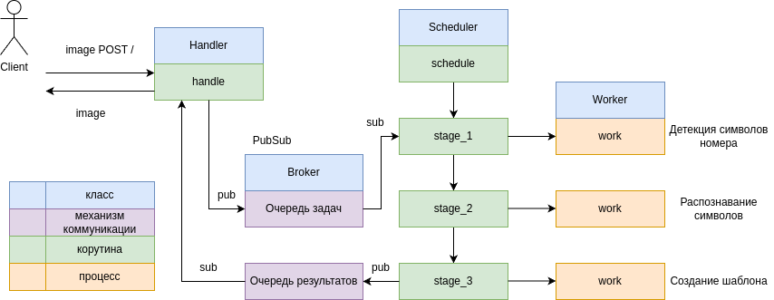

# Репозиторий команды tobytes() в задаче выравнивании регистрационных номеров

В рамках данного решения разработано решение состоящее из нескольких частей:
1. Обнаружение символов в регистрационном знаке и нарезка кропов символов из знаков с помощью yolov8n.
2. Получившиеся кропы отправляются на модель распознования символов EasyOCR. Обработанные символы соединяются в один ряд, образуя номер. 
3. Алгоритм на основе полного номера составляет шаблон из изображений заранее заготовленных цифр.

Финальное изображение передается дальше клиенту на трафарет и классификационную сеть resnet18.


# В рамках хакатона также было разработано фронтенд-решение на базе библиотеки Streamlit, позволяющее достаточно быстро развернуть и протестировать алгоритм.

В дефолтной конфигурации сервиса можно попробовать отправить регистрационный номер и получить выравненный шаблон.


## Стек
Python, docker, pytorch, yolov8, easyocr, streamlit

## Материалы, использованные для разработки решения:

- https://github.com/ultralytics/ultralytics
- https://github.com/JaidedAI/EasyOCR
- https://github.com/streamlit/streamlit
- https://git-lfs.com/
- https://www.docker.com/get-started/


## Взаимодействие с сервисом
Взаимодействие с сервисом представляет собой отправку POST-запроса на детекцию с получением результатов детекции. Пример:
```python
import pickle
import requests
import cv2


image_path = "fixtures/0b90c1c74d46abf7.jpg"
image = cv2.imread(image_path)
image_bytes = pickle.dumps(image)
files = {'file': ('filename', image_bytes)}
r = requests.post('http://127.0.0.1:8000/', files=files, timeout=20)
print("Result = ", r.json())
```

## Как запустить
### Без использования Docker
#### Требования
- Python 3.9

#### Установка
В корневой директории запустить

```bash
python install -r requirements.txt
```

#### Запуск
В корневой директории выполнить
```python plate-deformation/main.py```

Инициирует запуск сервиса на порту 8000.
При необходимости, можно задать переменную окружения `APP_PORT`, в которой указывается номер порта.

### С использованием Docker
#### Установка
В корневой директории выполнить
```bash
docker build -t plate-deformation .
```

#### Запуск
```bash
docker container run -p 8000:8000 plate-deformation
```

### Фронт

```bash
pip install streamlit
streamlit run front/main.py
```

## Формат ответа

Формат ответа представляет JSON, в котором находится единственное поле `img` со значением изображения в виде hex-строки.

## Как это работает
Клиент формирует и отправляет POST-запрос по URL `/`, указывая `file` (фотографию с номером).
Запрос приходит в `Handler.handle` и парсится в объект `Task`. Объект `Task` помещается в очередь задач pub-sub брокера,
забирается `Scheduler.schedule` для дальнейшего распределения на обработку. Обработка занимает три стадии, на каждую из
которых выделяется отдельный процесс: детекция символов номера, распознавание символов, создание шаблона. После прохождения
всех стадий, результаты детекции помещаются в очередь результатов pub-sub брокера, забираются `Handler.handle` и возвращаются
клиенту в рамках ответа на POST-запрос в виде hex-строки.


